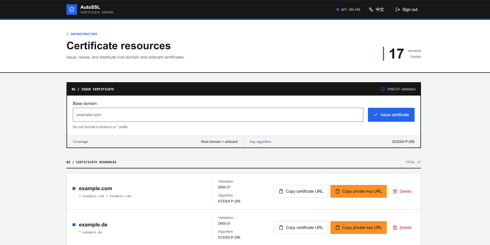

# AutoSSL

[简体中文](README.zh-CN.md)

**Add one CNAME record, then AutoSSL handles certificate issuance and renewal.**

Set up one domain, such as `alias.com`, on Cloudflare and give its API token to AutoSSL. Any other domain can point a CNAME record to a validation record under `alias.com`, even when it uses a different DNS provider. AutoSSL then uses [acme.sh DNS alias mode](https://github.com/acmesh-official/acme.sh/wiki/DNS-alias-mode) to issue and renew its certificate without needing that domain's DNS API credentials.

The certificate is still issued to the target domain, not `alias.com`. AutoSSL requests one ECDSA P-256 certificate containing both the base domain and its wildcard, then provides stable certificate and private-key URLs for deployment scripts.



## Why AutoSSL

| Direct DNS API issuance | AutoSSL |
| --- | --- |
| Store API credentials for every target DNS zone. | Store one Cloudflare token for the validation zone. |
| Depend on each target DNS provider's API. | The target provider only needs to support CNAME records. |
| Run issuance, renewal, and deployment on every server. | Issue and renew centrally; target servers only download files. |

The target domain does not need to use Cloudflare, expose its DNS API, or move its nameservers. The CNAME is configured once and reused for automatic renewal.

## How it works

Assume `alias.com` is the validation domain hosted on Cloudflare and `example.com` needs a certificate.

1. Set `ACME_ALIAS=alias.com` and `ACME_ALIAS_PER_DOMAIN=true` in AutoSSL.
2. Add this record to the DNS zone for `example.com`:

   ```dns
   _acme-challenge.example.com. CNAME _acme-challenge.example.com.alias.com.
   ```

3. Submit the base domain `example.com` in the AutoSSL console.
4. AutoSSL runs acme.sh with the Cloudflare DNS hook:

   ```sh
   acme.sh --issue --dns dns_cf \
     -d example.com -d '*.example.com' \
     --challenge-alias example.com.alias.com \
     --challenge-alias example.com.alias.com \
     --keylength ec-256
   ```

5. acme.sh uses `CF_Token` to write the TXT challenge under the Cloudflare zone. Let's Encrypt queries the target domain and follows the CNAME:

   ```text
   _acme-challenge.example.com
     CNAME -> _acme-challenge.example.com.alias.com
                 TXT <- written by acme.sh through the Cloudflare API
   ```

6. Let's Encrypt validates the TXT record and issues a certificate for `example.com` and `*.example.com`. AutoSSL installs the full chain and private key under stable download URLs.

AutoSSL runs `acme.sh --cron` every day at 01:30 container time. Keep the CNAME records and persist `/root/.acme.sh` so renewals continue to use the same validation path and ACME account.

## Setup

### 1. Prepare the Cloudflare validation domain

Add a domain such as `alias.com` to Cloudflare and use it as the dedicated DNS-01 validation zone. Create an API token scoped to this zone with DNS edit and zone read permissions, then record its Zone ID.

The token only needs access to `alias.com`; it does not need access to any target domain.

### 2. Add the target CNAME

For every target base domain, add the CNAME shown above. If the target domain also uses Cloudflare, set the record to **DNS only**. Do not remove the record after issuance because renewal reuses it.

### 3. Deploy AutoSSL

Create `docker-compose.yml`:

```yaml
services:
  autossl:
    image: ghcr.io/pupilcc/autossl:master
    container_name: autossl
    restart: always
    ports:
      - "3000:3000"
    volumes:
      - data:/root/data
      - acme:/root/.acme.sh
    environment:
      DOMAIN: https://ssl.example.com
      ADMIN_USERNAME: admin
      ADMIN_PASSWORD: replace-with-a-long-random-password
      ACME_CA: letsencrypt
      ACME_EMAIL: admin@example.com
      ACME_DNS: dns_cf
      ACME_ALIAS: alias.com
      ACME_ALIAS_PER_DOMAIN: "true"
      ACME_DEBUG: "false"
      CF_Zone_ID: xxxxxxxx
      CF_Token: xxxxxx

volumes:
  data:
  acme:
```

Start the service:

```sh
docker compose up -d
```

Configure the HTTPS reverse proxy so `ssl.example.com` reaches the web console on port `3000`. The Go API listens only on `127.0.0.1:1323` inside the container and must not be exposed directly. Then sign in and submit only the base domain, such as `example.com`; AutoSSL adds the wildcard automatically.

## Configuration

| Variable | Purpose |
| --- | --- |
| `DOMAIN` | Public console URL used to restrict administrative action origins and build `/dl/...` download links; omit the trailing slash. |
| `ADMIN_USERNAME` | Console username. |
| `ADMIN_PASSWORD` | Console password and JWT signing secret; use a long random value. |
| `ACME_CA` | acme.sh CA name, such as `letsencrypt`. |
| `ACME_EMAIL` | ACME account email. |
| `ACME_DNS` | acme.sh DNS hook; use `dns_cf` for the Cloudflare validation zone. |
| `ACME_ALIAS` | The single Cloudflare-managed validation domain. |
| `ACME_ALIAS_PER_DOMAIN` | Only `true` uses `<target-base-domain>.<ACME_ALIAS>`; every other value makes all domains share `ACME_ALIAS`. See below. |
| `ACME_DEBUG` | `true` enables acme.sh debug level 1. |
| `CF_Zone_ID` | Zone ID of the Cloudflare validation domain. |
| `CF_Token` | API token allowed to manage DNS records in that zone. |

### How `ACME_ALIAS_PER_DOMAIN` works

This variable controls whether AutoSSL creates a separate validation alias for each target domain or sends every target directly to `ACME_ALIAS`. It is enabled only when its value is `true` (case-insensitive); an unset value, `false`, or any other value disables it.

With `ACME_ALIAS=alias.com` and a certificate target of `example.com`:

| Setting | Validation alias passed to acme.sh | CNAME target | Result |
| --- | --- | --- | --- |
| `ACME_ALIAS_PER_DOMAIN=true` | `example.com.alias.com` | `_acme-challenge.example.com.alias.com` | Each target base domain uses an isolated record. Recommended. |
| Unset or not `true` | `alias.com` | `_acme-challenge.alias.com` | All target domains share one record, so concurrent validations can interfere. |

When enabled, the alias is built as `<target-base-domain>.<ACME_ALIAS>`. AutoSSL removes a trailing dot and a leading `*.` from the input and converts it to lowercase; for example, `*.Example.COM.` becomes `example.com.alias.com`. The `example.com` and `*.example.com` names on the same certificate deliberately share this alias, while other certificate targets get their own aliases. They can therefore share one Cloudflare zone and API token without sharing challenge records.

Each target domain's CNAME must match the selected mode. This variable affects the arguments generated when AutoSSL starts a new `acme.sh --issue`; `acme.sh --cron` uses its saved issuance configuration. When changing `ACME_ALIAS` or this variable, keep the old CNAME until the affected certificate has been reissued with the new configuration and its renewal path has been confirmed.

## Cloudflare Universal SSL conflict

If a target domain also uses Cloudflare, Universal SSL can publish hidden `_acme-challenge` TXT records in the target zone. Let's Encrypt may then reject the delegated challenge with `Incorrect TXT record`.

If this occurs, disable Universal SSL under **SSL/TLS -> Edge Certificates** for the target domain's zone, wait for DNS caches to expire, and retry. This affects proxied sites that rely on Cloudflare edge certificates, so confirm they have another valid edge certificate first. See [Cloudflare's explanation](https://developers.cloudflare.com/dns/manage-dns-records/troubleshooting/unexpected-dns-records/#acme_challenge-txt-records).

## Certificate distribution

The console provides `.crt` and `.key` URLs for every certificate. Each download code can be rotated independently, and rotation immediately invalidates the old URL. Private-key responses include `Cache-Control: no-store`; still treat the URL as a secret and expose AutoSSL only over HTTPS.

Use [scripts/distribute-certificates.sh](scripts/distribute-certificates.sh) on each target server. Replace the placeholder URLs and paths in `urls_and_paths`, keep the filenames `fullchain.pem` and `privkey.pem`, and run the script as root. It downloads files atomically, validates them with OpenSSL when available, fixes permissions, and reloads Nginx only when a file changed and `nginx -t` succeeds.
